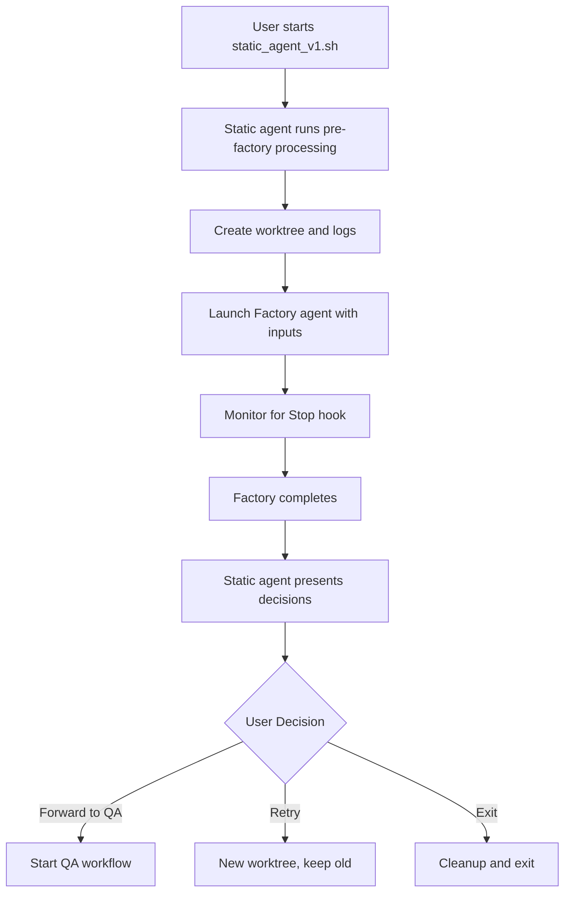
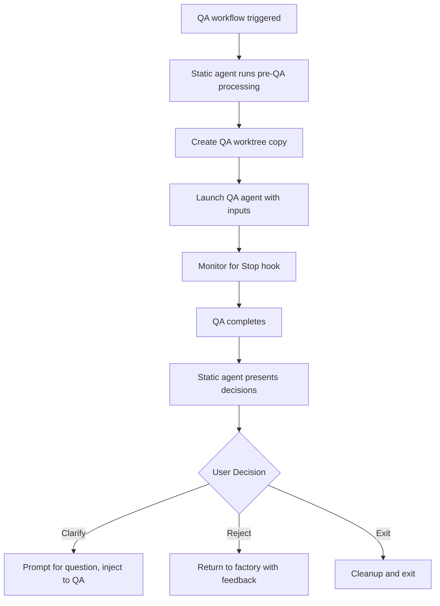

# Simple Two AI Agents + One Static Agent Setup v1 (Revised)
# PURPOSE_HASH: TS-2025-08-18-STATIC-AGENT-POC-V1-REV

## Executive Summary

This document outlines a minimal POC implementation of a static agent that orchestrates two AI agents (Factory and QA) through their complete lifecycle using tmux sessions and Claude Code hooks. The static agent manages worktrees, runs pre/post-processing scripts internally, monitors agent completion via the Stop hook, and presents decision options to the user based on agent outputs.

## Key Adjustments from Initial Plan

1. **Static Agent Owns Script Execution**: Pre/post scripts are run by the static agent, not the AI agents
2. **Worktree Management**: Static agent creates and manages git worktrees for isolation
3. **Agent Input Structure**: Agents receive TaskSpec, worktree path, context/handover, and log path
4. **Separate Worktrees**: Factory gets main worktree, QA gets read-only copy for review

## Architecture Overview

```
┌─────────────────────────────────────────────────────────┐
│                    Static Agent                          │
│         (bash script - orchestrator & executor)          │
│  - Creates worktrees and log directories                 │
│  - Runs pre/post processing scripts                      │
│  - Launches and monitors AI agents                       │
│  - Handles decision trees                                │
└────────────┬────────────────────────────┬────────────────┘
             │                            │
             ▼                            ▼
┌────────────────────────┐    ┌────────────────────────┐
│   Factory AI Agent     │    │     QA AI Agent        │
│  (tmux: factory-TS-*)  │    │   (tmux: qa-TS-*)      │
│                        │    │                        │
│  Inputs:               │    │  Inputs:               │
│  - TaskSpec            │    │  - TaskSpec            │
│  - Worktree path       │    │  - QA worktree path    │
│  - Context/handover    │    │  - Factory handover    │
│  - Log path            │    │  - Log path            │
│                        │    │                        │
│  Project Memory:       │    │  Project Memory:       │
│  - ./project-state-    │    │  - ./project-state-    │
│    readonly/           │    │    readonly/           │
│    (mounted read-only) │    │    (mounted read-only) │
└────────────────────────┘    └────────────────────────┘
```

## TaskSpec Format (Based on TaskSpec Structure)

```yaml
---
id: TS-2025-08-18-EXAMPLE-001
title: "Example task for implementation"
type: feature
status: draft  # draft|in-progress|qa|done
priority: high
owner: factory
loc_cap: 150
coverage_cap: 85
estimated_hours: 3
parent_featspec: FS-2025-08-18-FEATURE-001  # Optional

description: |
  Detailed description of what needs to be implemented

acceptance_criteria:
  - "Specific measurable criterion 1"
  - "Specific measurable criterion 2"
  - "Test coverage must be >= 85%"

technical_notes: |
  Any technical specifications or constraints
```

## Core Components

### 1. Static Agent (`static_agent_v1.sh`)

The static agent is the central orchestrator that:
- Manages the complete workflow lifecycle
- Creates and maintains worktrees33
- Executes pre/post processing scripts
- Launches AI agents with proper context
- Monitors for completion via Stop hooks
- Handles user decision trees

### 2. State Directory Setup (One-Time Configuration)

#### Permanent Read-Only Mount
The state directory (`../djhatch-state/`) is mounted read-only at `./djhatch-state-readonly-mount/` in the project root, providing all agents with automatic access to project state while preventing modifications.

```bash
# One-time setup (run as root or with sudo)
mkdir -p /home/lama/projects/djhatch/djhatch-state-readonly-mount
mount --bind /home/lama/projects/djhatch-state /home/lama/projects/djhatch/djhatch-state-readonly-mount
mount -o remount,ro,bind /home/lama/projects/djhatch/djhatch-state-readonly-mount

# Make permanent by adding to /etc/fstab:
echo "/home/lama/projects/djhatch-state /home/lama/projects/djhatch/djhatch-state-readonly-mount none bind,ro 0 0" >> /etc/fstab
```

This mount provides:
- **Automatic project awareness**: All agents see state as part of project structure
- **Kernel-level write protection**: Agents cannot modify state even if they try
- **Simple references**: Agents use `./djhatch-state-readonly-mount/_specs/taskspecs/TS-001.yaml` naturally
- **No per-agent setup**: Mount once, use everywhere

### 3. Pre-Processing Scripts (Static Agent Internal)

#### Pre-Factory Processing
```bash
# Executed by static agent before launching factory
1. Create log directory: _logs/TS-2025-08-18-EXAMPLE-001/
2. Create git worktree: git worktree add _worktrees/TS-001 -b TS-001
3. Initialize worktree with any templates or setup
4. Prepare context document for factory agent
```

#### Pre-QA Processing
```bash
# Executed by static agent before launching QA
1. Create QA worktree copy: cp -r _worktrees/TS-001 _worktrees/qa-TS-001
2. Collect factory handover/summary from logs
3. Prepare context document for QA agent
```

### 4. Agent Input Structure

#### Factory Agent Inputs
```bash
FACTORY_PROMPT="[AGENT_ID:FACTORY,ENV:DEV]
TaskSpec: $(cat djhatch-state-readonly-mount/_specs/taskspecs/$TASKSPEC_ID.yaml)
Worktree: /absolute/path/_worktrees/TS-001
Context: $CONTEXT_INFO  # Initially empty, contains QA feedback on retry
Log Path: /absolute/path/_logs/TS-001/factory.log
State Access: ./djhatch-state-readonly-mount/ contains all project state (read-only)
Instructions: Implement the TaskSpec in the provided worktree. Reference djhatch-state-readonly-mount/ for current project status and specifications."
```

#### QA Agent Inputs
```bash
QA_PROMPT="[AGENT_ID:QA,ENV:TST]
TaskSpec: $(cat djhatch-state-readonly-mount/_specs/taskspecs/$TASKSPEC_ID.yaml)
Worktree: /absolute/path/_worktrees/qa-TS-001  # Read-only copy
Context: $FACTORY_HANDOVER  # Summary from factory
Log Path: /absolute/path/_logs/TS-001/qa.log
State Access: ./djhatch-state-readonly-mount/ contains all project state (read-only)
Instructions: Review the implementation in the provided worktree. Reference djhatch-state-readonly-mount/ for acceptance criteria and project standards."
```

### 5. Claude Code Stop Hook Configuration

```json
{
  "hooks": {
    "Stop": [
      {
        "hooks": [
          {
            "type": "command",
            "command": "/home/user/projects/djhatch/_hatch_scripts/stop_hook_handler.sh"
          }
        ]
      }
    ]
  }
}
```

Stop hook handler creates a trigger file that the static agent monitors.

## Workflow Implementation

### Phase 1: Factory Agent Workflow



### Phase 2: QA Agent Workflow



## Decision Trees

### Factory Completion Decision Tree
```
Factory Agent Completed
├── Option 1: Forward to QA agent for review
│   └── Static agent prepares QA environment and launches QA
├── Option 2: Retry implementation in new worktree
│   ├── Create new worktree (keep old as reference)
│   └── Re-launch factory with previous context
└── Option 3: Exit workflow
    └── Save state and cleanup
```

### QA Completion Decision Tree
```
QA Agent Completed
├── Option 1: Ask QA for clarifying remarks
│   ├── Prompt user for specific question
│   └── Inject question to existing QA session
├── Option 2: Reject implementation
│   ├── Collect QA feedback summary
│   └── Return task to factory with feedback
└── Option 3: Exit workflow
    └── Save state and cleanup
```

## Directory Structure

```
djhatch/
├── djhatch-state-readonly-mount/        # Read-only mount of ../djhatch-state
│   ├── taskspecs/                 # Task specifications
│   │   └── TS-001.yaml
│   ├── featspecs/                 # Feature specifications
│   │   └── FS-001.yaml
│   ├── current_state.json         # Who's working on what
│   └── metrics/                   # Rejection counts, completion rates, etc.
├── _worktrees/                    # Git worktrees for implementation
│   ├── TS-001/                    # Factory worktree
│   ├── qa-TS-001/                 # QA review copy
│   └── TS-001-retry-1/            # Retry worktree (if needed)
├── _logs/
│   ├── static_agent.log           # Main orchestrator log
│   ├── TS-001/                    # TaskSpec-specific logs
│   │   ├── factory.log            # Factory agent output
│   │   ├── qa.log                 # QA agent output
│   │   ├── factory_handover.json  # Factory completion summary
│   │   └── qa_summary.json        # QA review summary
│   └── hooks/                     # Stop hook triggers
│       ├── factory-TS-001.stop
│       └── qa-TS-001.stop
└── _agents/                       # Agent prompts and scripts
    └── ...

../djhatch-state/                  # External state directory (source of truth)
├── taskspecs/                     # Master task specifications
├── featspecs/                     # Master feature specifications
├── current_state.json             # Real-time project state
└── metrics/                       # Project metrics and history
```

## Implementation Roadmap

### Step 0: One-Time Setup (Prerequisites)
- [ ] Create `../djhatch-state/` directory structure with taskspecs/, featspecs/, etc.
- [ ] Set up permanent read-only mount at `./djhatch-state-readonly-mount/`
- [ ] Add mount entry to `/etc/fstab` for persistence
- [ ] Verify mount is working and read-only

### Step 1: Core Infrastructure (Day 1)
- [ ] Create `static_agent_v1.sh` with argument parsing for TaskSpec ID
- [ ] Implement logging infrastructure with TaskSpec-based directories
- [ ] Create Stop hook handler script
- [ ] Implement hook monitoring using file polling
- [ ] Verify access to `djhatch-state-readonly-mount/` from scripts

### Step 2: Worktree Management (Day 1-2)
- [ ] Implement `create_worktree()` function for git worktree creation
- [ ] Implement `copy_worktree_for_qa()` function for QA review copy
- [ ] Add worktree cleanup functions
- [ ] Handle worktree naming for retries

### Step 3: Pre-Processing Functions (Day 2)
- [ ] Implement `pre_factory_processing()`:
  - Create log directory structure
  - Create and initialize worktree
  - Load TaskSpec from `djhatch-state-readonly-mount/_specs/taskspecs/`
  - Prepare factory context document
- [ ] Implement `pre_qa_processing()`:
  - Copy factory worktree for QA
  - Extract factory handover
  - Reference state from `djhatch-state-readonly-mount/`
  - Prepare QA context document

### Step 4: Agent Launch Functions (Day 3)
- [ ] Implement `launch_factory_agent()` with full input structure
- [ ] Implement `launch_qa_agent()` with full input structure
- [ ] Create prompt templates with all required inputs
- [ ] Add session naming and management

### Step 5: Monitoring & Decision Handling (Day 3-4)
- [ ] Implement `monitor_agent()` for Stop hook detection
- [ ] Implement factory decision tree handler
- [ ] Implement QA decision tree handler
- [ ] Add question injection for QA clarification

### Step 6: Context & Handover Management (Day 4)
- [ ] Implement factory handover extraction from logs
- [ ] Implement QA feedback summary extraction
- [ ] Create context documents for retry scenarios
- [ ] Handle feedback passing between agents

### Step 7: Testing & Polish (Day 5)
- [ ] Test complete factory → QA workflow
- [ ] Test retry scenarios with context preservation
- [ ] Test QA clarification injection
- [ ] Add error handling and recovery

## Key Functions to Implement

```bash
# Worktree management
create_worktree(taskspec_id, retry_num=0)
copy_worktree_for_qa(taskspec_id)
cleanup_worktrees(taskspec_id)

# Pre-processing
pre_factory_processing(taskspec_id, context="")
pre_qa_processing(taskspec_id)

# Agent lifecycle
launch_factory_agent(taskspec_id, worktree_path, context, log_path)
launch_qa_agent(taskspec_id, qa_worktree_path, factory_handover, log_path)
monitor_agent(session_name)
inject_command(session_name, command)

# Decision handling
present_factory_decisions()
handle_factory_decision(choice, taskspec_id)
present_qa_decisions()
handle_qa_decision(choice, taskspec_id)

# Context management
extract_factory_handover(taskspec_id)
extract_qa_feedback(taskspec_id)
prepare_retry_context(taskspec_id, qa_feedback)

# Logging
log_message(level, message)
capture_session_output(session_name, log_path)
```

## Error Handling Strategy

### Critical Checks
- Verify TaskSpec file exists before starting
- Ensure git worktree operations succeed
- Confirm tmux sessions launch properly
- Validate Stop hook triggers are detected

### Recovery Scenarios
- Worktree creation failure → Clean up and retry with different name
- Agent launch failure → Kill session and retry
- Stop hook timeout → Offer manual intervention
- Context extraction failure → Use fallback summary

## Success Metrics for POC

1. **State Management**
   - Read-only mount prevents any state modifications ✓
   - Agents can reference state naturally via `./djhatch-state-readonly-mount/` ✓
   - State remains consistent across all agent sessions ✓

2. **Worktree Management**
   - Successfully creates isolated worktrees ✓
   - QA gets read-only copy for review ✓
   - Retry creates new worktree preserving old ✓

3. **Agent Communication**
   - Agents receive all required inputs ✓
   - Context passes correctly between agents ✓
   - Handover information extracted properly ✓

4. **Decision Trees**
   - All decision paths function correctly ✓
   - Context preserved across retries ✓
   - QA feedback reaches factory on reject ✓

## Configuration Files Required

### 1. Stop Hook Handler (`_hatch_scripts/stop_hook_handler.sh`)
```bash
#!/bin/bash
# Extract session information and create stop trigger
SESSION_NAME=$(tmux display-message -p '#S' 2>/dev/null || echo "unknown")
STOP_FILE="/home/user/projects/djhatch/_logs/hooks/${SESSION_NAME}.stop"
mkdir -p "$(dirname "$STOP_FILE")"
echo "STOP:$(date +%s):$SESSION_NAME" > "$STOP_FILE"

# Extract and save agent summary if available
if [[ "$SESSION_NAME" == factory-* ]]; then
    # TODO: Extract factory handover from session
    echo '{"status":"complete","timestamp":"'$(date +%s)'"}' > "${STOP_FILE%.stop}.handover"
elif [[ "$SESSION_NAME" == qa-* ]]; then
    # TODO: Extract QA summary from session
    echo '{"decision":"review_complete","timestamp":"'$(date +%s)'"}' > "${STOP_FILE%.stop}.summary"
fi
```

### 2. TaskSpec Template (`_taskspecs/template.yaml`)
```yaml
---
id: TS-YYYY-MM-DD-NAME-NNN
title: "Task title"
type: feature|bugfix|refactor
status: draft
priority: high|medium|low
owner: factory
loc_cap: 150
coverage_cap: 85
parent_featspec: FS-YYYY-MM-DD-NAME-NNN  # Optional

description: |
  What needs to be done

acceptance_criteria:
  - "Criterion 1"
  - "Criterion 2"

technical_notes: |
  Technical details
```

## Testing Scenarios

1. **Happy Path**: TaskSpec → Factory → QA → Approval
2. **Retry Path**: TaskSpec → Factory → QA → Reject → Factory (with feedback) → QA → Approval
3. **Clarification Path**: TaskSpec → Factory → QA → Clarify (question) → QA responds → Decision
4. **Multi-Retry Path**: Multiple factory attempts with preserved worktrees

## Future Enhancements (Not in v1)

- TaskSpec state machine and persistence
- Automated decision making based on QA results
- Parallel agent execution for multiple TaskSpecs
- Integration with existing TaskSpec/FeatSpec systems
- Web UI for monitoring progress
- Metrics and analytics dashboard

## Next Steps

1. Create the static_agent_v1.sh core structure
2. Implement worktree management functions
3. Set up Stop hook handler
4. Test individual components
5. Integrate and test complete workflows
6. Document any discovered issues

---

*This revised plan focuses on the static agent as the central orchestrator that manages all operational aspects, while AI agents focus purely on implementation and review tasks. The static agent handles worktrees, logging, context management, and decision trees.*